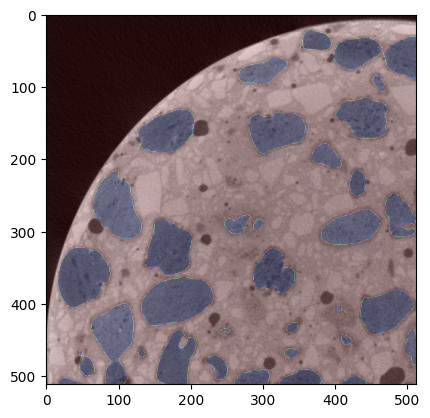

# `concrete_image_segmentation`
A package that uses the [U-Net](https://paperswithcode.com/paper/u-net-convolutional-networks-for-biomedical) neural network architecture to segment 3D grayscale images of concrete samples.

## Project Setup

To set up the project locally follow these steps.

### Prerequisites

Make sure you have the following tools installed on your system:

- [Git](https://git-scm.com/) (Version control system)
- [miniconda](https://docs.anaconda.com/miniconda/) (Software dependency management system)

### Installation

1. **Clone the Repository:**
    Clone the repo and navigate to the folder

    ```bash
    git clone https://github.com/nickgiki/concrete_image_segmentation.git

    cd concrete_image_segmentation
    ```
2. **Create and activate a new conda environment:**
    Create a new conda environment with python 3.11

    ```anaconda
    conda create -n concrete_image_segmentation python=3.10
    ```

    Follow the instructions to complete the installation.

    After the installation is completed activate the new environment


    ```bash
    conda activate concrete_image_segmentation
    ```

3. **Install the package and dependencies:**

    Install the `concrete_image_segmentation` package and its dependencies.

    ```bash
    pip install .
    ```

### Usage

- **Preparing a 3D image for training**

    If you have a `.raw` 3D image you need to first cut each cross-section (slice) into four quadrants. To do this, start a new python shell and run this:

    ```python
    from concrete_image_segmentation.utils3d import cut_and_save

    MY_IMAGE_PATH = "my_image.raw"

    cut_and_save(MY_IMAGE_PATH, cut="quad", eight_bit=True, crop=100)
    ```
    The cut images are now contained in a new folder named "my_image".
    To split the images randomly to train and test run:

    ```python
    train_test_split("my_image")
    ```
    This function creates three new subdirectories `"train"`, `"drop"` and `"test"`, each with two subdirs `"images"` and `"label"`. The approach is, we train the model on first 75% of cross-sections, drop the next 5% of cross-sections and use the remaining 20% for prediction.

    For a more detailed data-preprocessing walkthrough check `notebooks/image_exploration.ipynb`.

- **Running a training pipeline**

    A full training notebook example on [Google Colab](https://colab.research.google.com/) can be found in `notebooks/ntua_concrete_samples_train.ipynb`.

- **Predicting new images**
    When you have trained and saved your model (i.e. in drive path `./downloads/my_model.hdf5`) you can load it by running the following in a python console:

    ```python
    import tensorflow as tf

    model = tf.keras.models.load_model("./downloads/my_model.hdf5")
    ```

    Then you can predict a new image (say in path `./downloads/my_image.png`) running (in the same console):

    ```python
    import skimage.io as io
    from concrete_image_segmentation.utils3d import predict_mod
    import matplotlib.pyplot as plt

    x = io.imread("./downloads/my_image.png", as_gray=True) / 255
    prediction = predict_mod(model,x)

    def overlay_mask2(x, y):
        """Custom image that overlays the prediction on top of the original image"""
        plt.imshow(x, cmap="gray")
        plt.imshow(y, cmap="jet", alpha=0.2)

    overlay_mask(x, prediction)
    ```

    This should output an image like this one:
    ```markdown
    
    ```

    A full prediction example can be found in `notebooks/ntua_concrete_samples_predict.ipynb`.
